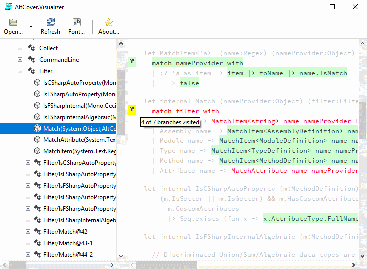

# altcover
Instrumenting coverage tool for .net (framework 2.0+  and core) and Mono, reimplemented and extended almost beyond recognition from [dot-net-coverage](https://github.com/SteveGilham/dot-net-coverage), plus a set of related utilities for processing the results from this and from other programs producing similar output formats.

## Never mind the fluff -- how do I get started?

Start with the [Quick Start guide](https://github.com/SteveGilham/altcover/wiki/QuickStart-Guide)

The latest releases can be downloaded from [releases](https://github.com/SteveGilham/altcover/releases), but the easiest (and most automated) way is through the [nuget package](https://www.nuget.org/packages/AltCover).

## What's in the box?

For Mono, .net framework and .net core, except as noted

* `AltCover`, a command-line tool for recording code coverage (including dotnet and global tool versions)
* MSBuild tasks to drive the tool, including `dotnet test` integration
* An API for the above functionality, with Fake and Cake integration
* A PowerShell module (not mono) containing a cmdlet that drives the tool, and other cmdlets for manipulating coverage reports
* A coverage visualizer tool 
  * For .net framework and mono (for .net framework, needs GTK# v2.12.xx installed separately -- see https://www.mono-project.com/download/stable/#download-win )
  * For .net core (needs GTK+3 installed separately -- for Windows, see e.g. https://github.com/GtkSharp/GtkSharp/wiki/Installing-Gtk-on-Windows)
  
    
### NuGet Packages
* [General purpose install](https://www.nuget.org/packages/AltCover) -- excludes the C# API and FAKE integration
* [API install](https://www.nuget.org/packages/AltCover.api) -- excludes the .net Framework/mono/GTK#2 Visualizer
* [dotnet CLI tool install](https://www.nuget.org/packages/AltCover.dotnet) -- excludes the visualizer in all forms
* [dotnet global tool install](https://www.nuget.org/packages/AltCover.global) -- excludes the visualizer in all forms
* [Visualizer dotnet global tool](https://www.nuget.org/packages/AltCover.visualizer) -- just the .net core/GTK#3 Visualizer as a global tool
* [FAKE build task utilities](https://www.nuget.org/packages/AltCover.Fake) -- just AltCover related helper types for FAKE scripts (v5.9.3 or later), only in this package

## Why altcover?
As the name suggests, it's an alternative coverage approach.  Rather than working by hooking the .net profiling API at run-time, it works by weaving the same sort of extra IL into the assemblies of interest ahead of execution.  This means that it should work pretty much everywhere, whatever your platform, so long as the executing process has write access to the results file.  You can even mix-and-match between platforms used to instrument and those under test.

In particular, while instrumenting .net core assemblies "just works" with this approach, it also supports Mono, as long as suitable `.mdb` (or `.pdb`, in recent versions) symbols are available.  One major limitation here is that the `.mdb` format only stores the start location in the source of any code sequence point, and not the end; consequently any nicely coloured reports that take that information into account may show a bit strangely.  

### Why altcover? -- the back-story of why it was ever a thing

Back in 2010, the new .net version finally removed the deprecated profiling APIs that the free NCover 1.5.x series relied upon.  The first version of AltCover was written to both fill a gap in functionality, and to give me an excuse for a ground-up F# project to work on.  As such, it saw real production use for about a year and a half, until OpenCover reached a point where it could be used for .net4/x64 work (and I could find time to adapt everything downstream that consumed NCover format input).

Fast forwards to autumn 2017, and I get the chance to dust the project off, with the intention of saying that it worked on Mono, too -- and realise that it's _déja vu_ all over again, because .net core didn't yet have profiler based coverage tools either, and the same approach would work there as well.

### Other notes

1. On old-fashioned .net framework, the `ProcessExit` event handling window of ~2s is sufficient for processing significant bodies of code under test (several 10s of kloc, as observed in production back in the '10-'11 timeframe); under `dotnet test` the window seems to be rather tighter (about 100ms, experimentally, about enough for 1kloc).  Therefore, the preferred way to perform coverage gathering for .net core, except for the smallest programs, is to run with AltCover in the "runner" mode.  By their nature, unit tests invoking significant frameworks are not small programs, even if the system under test is itself small.

2. Under Mono on non-Windows platforms the default values of `--debug:full` or `--debug:pdbonly` generate no symbols from F# projects -- and without symbols, such assemblies cannot be instrumented.  Unlike with C# projects, where the substitution appears to be automatic, to use the necessary `--debug:portable` option involves explicitly hand editing the old-school `.fsproj` file to have `<DebugType>portable</DebugType>`.  

## Continuous Integration

| | | |
| --- | --- | --- | 
| **Build** | AppVeyor    | Travis  |
| **Unit Test coverage** | Coveralls  |
| **Nuget** |   |
| (.api) |   |
| (.dotnet) |   |
| (.global) |   |
| (.visualizer) |   |

## Usage

See the [Wiki page](https://github.com/SteveGilham/altcover/wiki/Usage) for details

## Roadmap

See the [current project](https://github.com/SteveGilham/altcover/projects/7) for details

## Building

### Tooling

#### All platforms

It is assumed that the following are available

.net core SDK 2.1.401 or later (`dotnet`) -- try https://www.microsoft.com/net/download  
PowerShell Core 6.0.2 or later (`pwsh`) -- try https://github.com/powershell/powershell

#### Windows

You will need Visual Studio VS2017 (Community Edition) v15.8.latest with F# language support (or just the associated build tools and your editor of choice).  The NUnit3 Test Runner will simplify the basic in-IDE development cycle.  Note that some of the unit tests expect that the separate build of test assemblies under Mono, full .net framework and .net core has taken place; there will be up to 20 failures when running the unit tests in Visual Studio from clean when those expected assemblies are not found.

For the .net 2.0 support, if you don't already have FSharp.Core.dll version 2.3.0.0 (usually in Reference Assemblies\Microsoft\FSharp\.NETFramework\v2.0\2.3.0.0), then you will need to install this -- the [Visual F# Tools 4.0 RTM](https://www.microsoft.com/en-us/download/details.aspx?id=48179) `FSharp_Bundle.exe` is the most convenient source. 

For GTK# support, the GTK# latest 2.12 install is expected -- try https://www.mono-project.com/download/stable/#download-win  

#### *nix

It is assumed that `mono` (version 5.14.x) and `dotnet` are on the `PATH` already, and everything is built from the command line, with your favourite editor used for coding.

### Bootstrapping

Start by setting up `dotnet fake` with `dotnet restore dotnet-fake.fsproj`
Then `dotnet fake run ./Build/setup.fsx` to do the rest of the set-up.

### Normal builds

Running `dotnet fake run ./Build/build.fsx` performs a full build/test/package process.

Use `dotnet fake run ./Build/build.fsx --target <targetname>` to run to a specific target.

#### If the build fails

If there's a passing build on the CI servers for this commit, then it's likely to be one of the [intermittent build failures](https://github.com/SteveGilham/altcover/wiki/Intermittent-build-issues) that can arise from the tooling used. The standard remedy is to try again.

### Unit Tests

The tests in the `Tests.fs` file are ordered in the same dependency order as the code within the AltCover project (the later `Runner` tests aside).  While working on any given layer, it would make sense to comment out all the tests for later files so as to show what is and isn't being covered by explicit testing, rather than merely being cascaded through.

## Thanks to

* [AppVeyor](https://ci.appveyor.com/project/SteveGilham/altcover) for allowing free build CI services for Open Source projects
* [travis-ci](https://travis-ci.org/SteveGilham/altcover) for allowing free build CI services for Open Source projects
* [Coveralls](https://coveralls.io/r/SteveGilham/altcover) for allowing free services for Open Source projects
